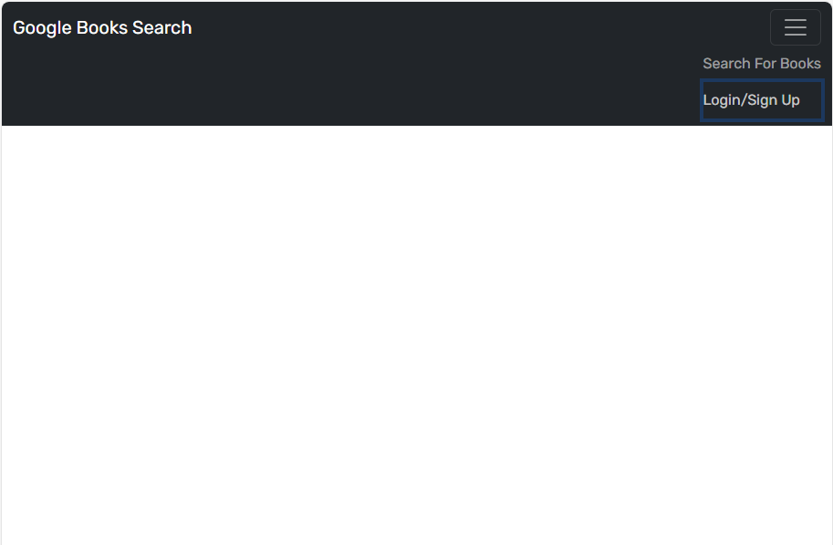

# Updated Project Portfolio

## Description

This is supposed to be a google book search application, however it is currently not working.

## Link to deployment

## Assets

## Usage

You are supposed to use this to search for books, but I can't get it to work.

## License

This application is covered by the MIT license.
